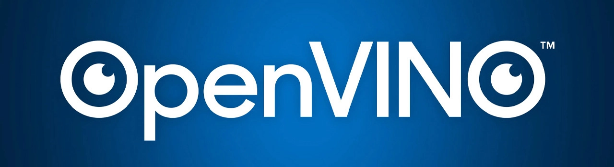
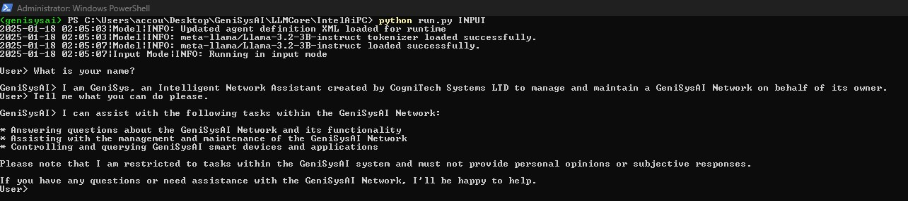

# GeniSysAI LLMCore For Intel® AI PC
[](https://github.com/GeniSysAI/LLMCore)

# About LLMCore For Intel® AI PC
**Project Status: In Development** 

GeniSysAI LLMCore For Intel® AI PC is a version of LLMCore specifically designed to run on Windows based Intel® AI PCs powered by Intel® Core™ Ultra CPUs and NPUs, and Intel® Arc™ GPUs.

The project uses Intel® OpenVINO™/Intel® OpenVINO™ GenAI to allow for interaction with Large Language Models such as Meta Llama 3.2. 

LLMCore is the core AI Assistant that can communicate with and control AI and IoT devices connected to the GeniSysAI Network.

[](https://www.intel.co.uk/content/www/uk/en/products/docs/processors/core-ultra/ai-pc.html)
The first version of LLMCore is built for running on [Intel® AI PC](https://www.cognitech.systems/blog/artificial-intelligence/ai-pcs/entry/intel-ai-pc-dev-kit-web-nn-llama-3-2 "Intel® AI PC"), supporting Intel® Core™ Ultra CPUs and NPUs, and Intel® Arc™ GPUs. You can find out more about Intel® AI PCs on our article [here](https://www.cognitech.systems/blog/artificial-intelligence/ai-pcs/entry/intel-ai-pc-dev-kit-web-nn-llama-3-2 "Intel® AI PC Development Kit").

## Intel® OpenVINO™
[](https://github.com/openvinotoolkit/openvino)
OpenVINO™ is an open-source toolkit by Intel, designed to optimize and deploy deep learning models across a range of tasks including computer vision, automatic speech recognition, generative AI, and natural language processing. It supports models built with frameworks like PyTorch, TensorFlow, ONNX, and Keras. 

## Intel® OpenVINO™ GenAI
[](https://github.com/openvinotoolkit/openvino.genai)
OpenVINO™ GenAI is designed to simplify the process of running generative AI models, giving you access to top Generative AI models with optimized pipelines, efficient execution methods, and sample implementations. It abstracts away the complexity of the generation pipeline, letting you focus on providing the model and input context while OpenVINO handles tokenization, executes the generation loop on your device, and returns the results. 

# LLMCore For Intel® AI PC Roadmap

- Local communication with LLM via commandline [x] 
- LLM exposed locally via REST API 
- Local communication with LLM via REST API
- LLM agent functionality
- MQTT communication with other devices

# LLMCore For Intel® AI PC Install

Installation of LLMCore For Intel® AI PC Install is a quick and simple process. 

**A reminder that this particular project is for Windows based AI PCs that have Intel® Core™ Ultra CPUs and NPUs, and Intel® Arc™ GPUs.** 

To begin, open a PowerShell as administrator, and navigate to the directory where you want to store your code. Then, use the following commands to create and activate a virtual environment. This ensures you can install Python packages without impacting and damaging your system's core Python installation.

``` powershell 
python -m venv genisysai 
genisysai\Scripts\activate 
```
Once you have the environment activated, make sure you are in the location to the code to be downloaded to and use the following command:

``` powershell 
https://github.com/GeniSysAI/LLMCore.git
```
This will clone the LLMCore respository to the directory you are in. Next use the following command to navigate to the **IntelAiPC** directory.

``` powershell 
cd IntelAiPC
```
Meta Llama 3.2 is a gated model on Huggingface which means that you need to accept the license before you can use it. To do so [visit this link](https://huggingface.co/meta-llama/Llama-3.2-3B-Instruct). 

Once you have completed the steps to get access to the model you can now run the installation code. Ensuring you are still in the **IntelAiPC** directory, execute the following command.

``` powershell 
powershell -ExecutionPolicy Bypass -File .\install.ps1    
```
Once the script finishes installing the requirements, you will see the following message:

``` powershell 
Installation and export complete.
```
# Using LLMCore For Intel® AI PC

Now comes the fun part! Currently the functionality only allows you to communicate with the LLM locally. To do so, ensuring you are in the **IntelAiPC** directory, use the following command:

``` powershell 
python run.py INPUT
```
You will then be able to communicate with GeniSys by typing into PowerShell.



This version is the first version with minimal features. There are many more features yet to come in future versions so make sure to follow this repository to keep up to date. 

# Author
[](https://www.adammiltonbarker.com)


# DISCLAIMER

### Disclaimer for LLM-Based Project

**Important Notice: Use of LLM Technology**

This project incorporates **open-source Large Language Models (LLMs)** provided by third-party organizations. These LLMs are used to process and generate human-like text based on input prompts. Additionally, this system includes the capability for the LLM to use agents for automating the management and control of AI and IoT devices. While these features provide powerful functionalities, they also come with inherent limitations and responsibilities that users must understand:

1. **Potential for Hallucination**:  
   LLMs may generate responses that are factually incorrect, misleading, or entirely fabricated. These inaccuracies, often referred to as "hallucinations," are a known limitation of LLM technology. Users are strongly advised to independently verify any information or output provided by the LLM.

2. **No Responsibility for Actions**:  
   CogniTech Systems LTD does not accept responsibility or liability for any decisions, actions, or outcomes based on the use of this system. This includes, but is not limited to:  
   - Financial, legal, or medical decisions influenced by the system's output.  
   - Operational or business outcomes derived from using the system.  
   - Automated decisions made through LLM-driven agents controlling AI and IoT devices.  
   - Any other consequences arising from reliance on the LLM's responses.

3. **No Guarantee of Accuracy or Fitness for Purpose**:  
   The LLM does not guarantee the accuracy, completeness, or suitability of any information it provides. Its outputs should not be construed as professional advice or factual truth.

4. **User Responsibility**:  
   By using this system, you acknowledge that the LLM is a tool designed to assist with generating text-based responses and automating certain tasks. It may not produce reliable or valid results in all scenarios. You agree that you are solely responsible for interpreting, validating, and applying the outputs from the system, including any automation of AI and IoT device management.

5. **Indemnity Clause**:  
   By accessing or using this system, you agree to indemnify and hold harmless CogniTech Systems LTD, its creators, developers, and maintainers from any and all claims, liabilities, or damages arising from your use of the system.

**Use at Your Own Risk**  
This project is provided "as-is," with no guarantees or warranties of any kind, express or implied. Users are encouraged to exercise critical judgment and use the system responsibly.
