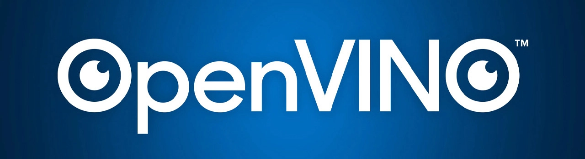

# GeniSysAI LLMCore

GeniSysAI LLMCore is the successor to the [GeniSysAI NLU Engine](https://github.com/GeniSysAI/Vision "GeniSysAI NLU Engine"), the retrieval based natural language understanding engine that was the core of the GeniSysAI network. GeniSysAI LLMCore takes advantage of modern day AI technologies, replacing traditional natural language understanding with powerful generative AI models and modern day libraries. 

GeniSysAI LLMCore currently supports the following hardware:

- [Intel® AI PC](IntelAiPC "Intel® AI PC")

# Intel® AI PC

The first version of LLMCore is built for running on [Intel® AI PC](https://www.cognitech.systems/blog/artificial-intelligence/ai-pcs/entry/intel-ai-pc-dev-kit-web-nn-llama-3-2 "Intel® AI PC"), supporting Intel® Core™ Ultra CPUs and NPUs, and Intel® Arc™ GPUs. You can find out more about Intel® AI PCs on our article [here](https://www.cognitech.systems/blog/artificial-intelligence/ai-pcs/entry/intel-ai-pc-dev-kit-web-nn-llama-3-2 "Intel® AI PC Development Kit").

## Intel® OpenVINO™

OpenVINO™ is an open-source toolkit by Intel, designed to optimize and deploy deep learning models across a range of tasks including computer vision, automatic speech recognition, generative AI, and natural language processing. It supports models built with frameworks like PyTorch, TensorFlow, ONNX, and Keras. 

## Intel® OpenVINO™ GenAI

OpenVINO™ GenAI is designed to simplify the process of running generative AI models, giving you access to top Generative AI models with optimized pipelines, efficient execution methods, and sample implementations. It abstracts away the complexity of the generation pipeline, letting you focus on providing the model and input context while OpenVINO handles tokenization, executes the generation loop on your device, and returns the results. 

# Author

